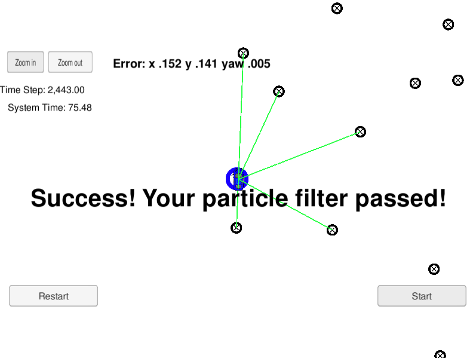

# CarND-Kidnapped-Vehicle-P3
Udacity Self-Driving Car Nanodegree - Kidnapped Vehicle project

# Overview

This project implements a [Particle Filter](https://en.wikipedia.org/wiki/Particle_filter) applied to a [Kidnapped robot(car) problem](https://en.wikipedia.org/wiki/Kidnapped_robot_problem). A simulator is provided by Udacity ([it could be downloaded here](https://github.com/udacity/self-driving-car-sim/releases)). This simulator will generate noisy landmark observation from a car to the Particle Filter using [WebSocket](https://en.wikipedia.org/wiki/WebSocket). The Particle Filter uses the [uWebSockets](https://github.com/uNetworking/uWebSockets) WebSocket implementation to respond to this observation with the estimated car position. Udacity provides a seed project to start from on this project ([here](https://github.com/udacity/CarND-Kidnapped-Vehicle-Project)).

# Prerequisites

The project has the following dependencies (from Udacity's seed project):

- cmake >= 3.5
- make >= 4.1
- gcc/g++ >= 5.4
- Udacity's simulator.


# Compiling and executing the project

In this project, Udacity's seed repo provides scripts to clean, compile and run it. These are the following commands you need to run from this repo directory

```
> ./clean.sh
> ./build.sh
> ./run.sh
```

You will see a message indicating the filter is listening:

```
> ./run.sh
Listening to port 4567

```

When you open the simulator the following screen appears:

Using the right arrow, you need to go to the Kidnapped Vehicle project

Clicking on "Select," the simulator for the Kidnapped project start and the Particle Filter informs it is connected:

Clicking on "Start" button, the vehicle starts moving, and the blue circle(the filter calculated position) moves with it. After a while, the simulator informs you if your Particle Filter passed or failed. Here is an example of the filter passing the test:


